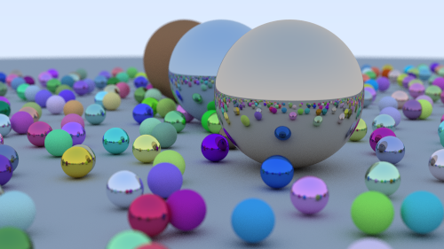

# Traci



## Build from Source

Traci is written in Rust. To compile to an executable, you first need a working installation of the Rust and Cargo. Please visit [the official Rust website](https://www.rust-lang.org/) for instructions. Then, to compile (with dependencies for math libraries, etc.), run the following command from the root of the project directory:

```
cargo run --release
```

> Note: it it important to use the `--release` flag to ensure that the project gets compiled with optimizations. This makes a very bug difference in runtime of the ray tracer.

This will fetch all dependencies, compile, and run the resulting binary (which is saved to `target/release/traci`). The output image is saved to `images/out.png`. The sample image shown on this README was rendered at full HD resolution with 1000 samples per pixel on an 8 core CPU. Rendering took just under 10 minutes.

## Performance and Creative Features

The ray tracer implements the functionality in the project specification along with the following additional features:

- Multi-core parallelism for faster rendering
- Translucent multi-colored balls (i.e. refract light but are also colored)

## TODO

[x] Commented code
[x] Ray-Plane Intersection
[x] Ray-Sphere Intersection
[x] Ray-Triangle Intersection
[x] Movable Camera
[x] Orthographic and Perspective Projection
[x] Multi-Jittered Sampling
[x] Simple Diffuse Shading
[x] Hard Shadows

[x] Import a Mesh
[x] Per-vertex normals
[x] Smooth shading
[x] Construct BVH
[x] BVH speedup
[x] 10000 Spheres
[x] 100000 Spheres
[ ] Technical Report
