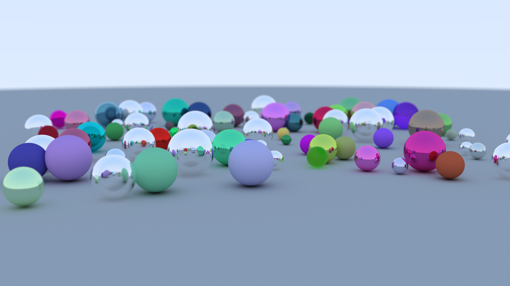

# Traci



## Build from Source

Traci is written in Rust. To compile to an executable, you first need a working installation of the Rust and Cargo. Please visit [the official Rust website](https://www.rust-lang.org/) for instructions. Then, to compile (with dependencies for math libraries, etc.), run the following command from the root of the project directory:

```
cargo run --release
```

> Note: it it important to use the `--release` flag to ensure that the project gets compiled with optimizations. This makes a very bug difference in runtime of the ray tracer.

This will fetch all dependencies, compile, and run the resulting binary (which is saved to `target/release/traci`). The output image is saved to `images/out.png`. The sample image shown on this README was rendered at full HD resolution with 1000 samples per pixel on an 8 core CPU. Rendering took just under 10 minutes.

## Performance and Creative Features

The ray tracer implements the functionality in the project specification along with the following additional features:

- Multi-core parallelism for faster rendering
- Translucent multi-colored balls (i.e. refract light but are also colored)

## BVH Performance Analysis

An optional feature that can improve rendering time is the bouding volume hierarchy (BVH). This uses a tree-like data structure with bounding boxes to decrease the number of calld to the `hit` function. You can opt to use a BVH by simpy adding a call to the `accelerate` function no your `Scence`. Note that this may incur a performance penalty if your scene contains only asmall number of objects.

Here is quick comparison of the rendering times with and without the BVH.

| Number of Spheres | Render Time (BVH) | Render Time (no BVH) | Speed-Up Factor |
| ----------------- | ----------------- | -------------------- | --------------- |
| 1,000             | 7.71 s            | 16.34 s              | 2.12            |
| 10,000            | 9.97 s            | 105.06 s             | 10.5            |
| 100,000           | 19.66 s           | N/A (est. 26 m)      | ~79.3           |
| 1,000,000         | 51.82 s           | N/A (est. 05 h)      | ~347            |

All experiements were run on a MacBook Air (13-inch, 2017) with the following hardware:

- **Processor:** 1.8 GHz Dual-Core Intel Core i5
- **Memory:** 8 GB 1600 MHz DDR3
- **Graphics:** Intel HD Graphics 6000 1536 MB

## TODO

[x] Commented code
[x] Ray-Plane Intersection
[x] Ray-Sphere Intersection
[x] Ray-Triangle Intersection
[x] Movable Camera
[x] Orthographic and Perspective Projection
[x] Multi-Jittered Sampling
[x] Simple Diffuse Shading
[x] Hard Shadows

[x] Import a Mesh
[x] Per-vertex normals
[x] Smooth shading
[x] Construct BVH
[x] BVH speedup
[x] 10000 Spheres
[x] 100000 Spheres
[x] Technical Report
